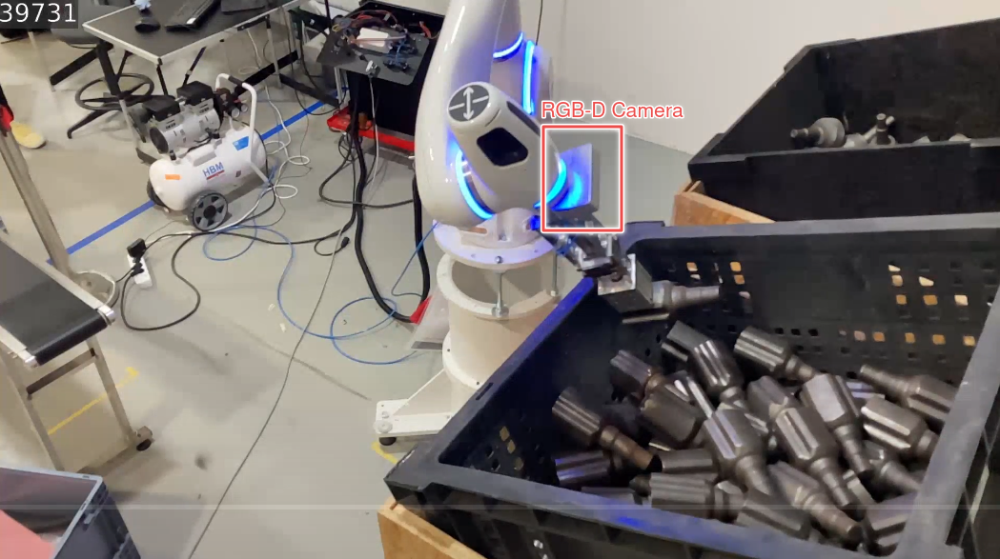
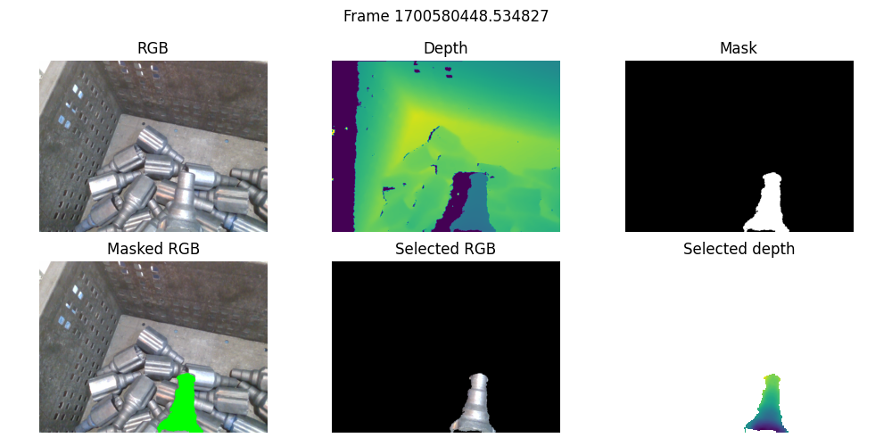
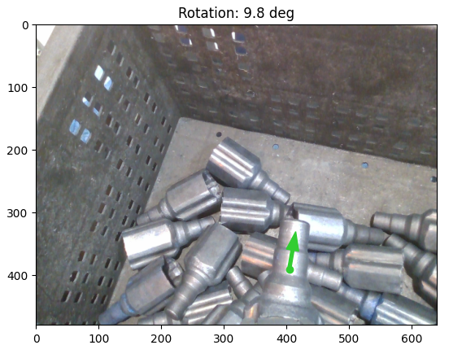

# Neura AI Pose Corrector Challenge

## Getting started

Welcome to the **Neura AI Pose Corrector challenge**, this challenge is divided into three consecutive tasks, with increasing complexity. You would have been informed of the tasks you're expected to complete in the notification email. 


Popular image processing libraries like OpenCV, Open3D etc. along with ROS which are open source, can be used to solve these tasks. It is ideally expected that the candidate solves the problem using the C++ language. Python can be used, but Matlab is not permitted.

---
**Background**: The tasks are created as a part of a robotic pick and place, where the state of the metallic object (named `inboard`) that is attached to an end-effector of a cognitive robot (i.e. a magnetic gripper) is monitored using the camera that is mounted on the robot. The camera points towards the attached object as seen in the image below:


---

## Input Data

In implementation and testing of your code to solve the tasks, please make use of the data provided as a downloadable link in your challenge invitation email.

The downloaded compressed folder `pose_corrector_data.zip` is to be extracted to obtain access to the following content:

- ROS bag file of a recorded sequence from the bin picking scenario
- `inboard` object RGB-D image dataset
- `inboard` object textured 3D mesh and symmetry info  

> Note: you are not constrained to the provided ROS Package naming/template, please feel free to use the tools/approaches that you want.

## Tasks
> Please click on the link below to see Task details
1. [Task 1: Object Isolation](docs/task_1.md)
2. [Task 2: Object Orientation](docs/task_2.md)
3. [Task 3: 6D Pose Estimation](docs/task_3.md)

## Submission
Please submit your code either as a link to a public access repository(GitHub, GitLab, Gitee, etc.), or as compressed file by email. 

We expect documentation with instructions on how to run and a description of your solution.

Any media that showcases your solution is also appreciated.

## Evaluation
The evaluation will assess the following aspects:
1. Comprehension:
    - Understanding of the task.
    - Approach into solving the problem.
2. Code:
    - Functionality.
    - Optimality.
    - Clarity.
    - Coding style.

> Note: Please don't hesitate to submit your code by the deadline, even if it solves part of the tasks and not all of them.


## Results

Object Isolation:



Object Orientation:



6D Pose Estimation:


To reproduce the results, install the dependencies via:
```
conda env create -f pose-corrector.yml
conda activate pose-corrector
```
and run the [notebook](pose-corrector.ipynb).
