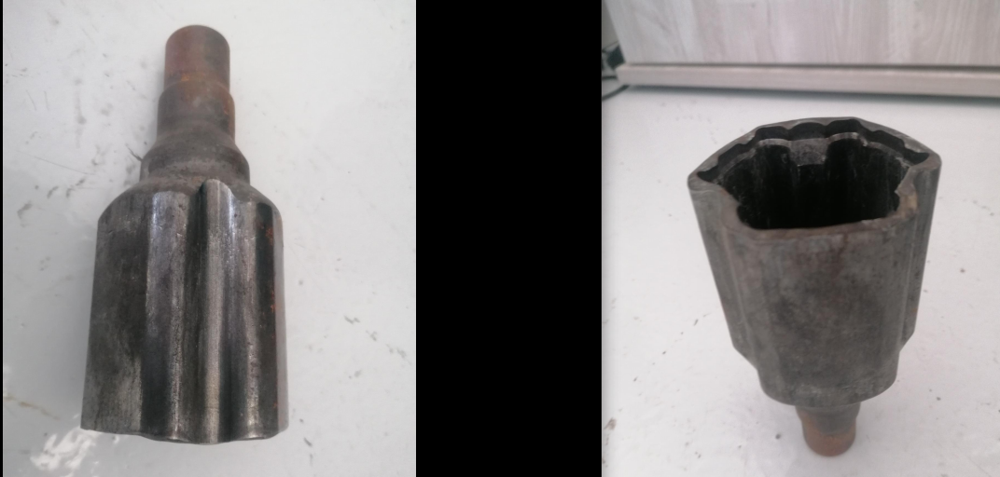
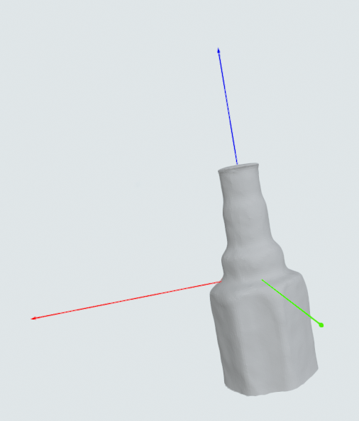
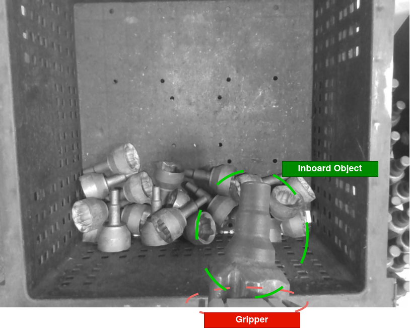
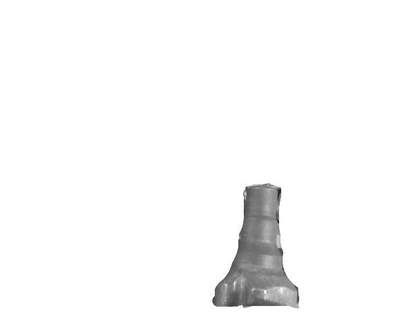

# Task 1: Object Isolation

The goal of this task is to detect the `inboard` that is attached to the gripper, and to isolate it from other objects in the scene by creating a **mask**. The attached object could be found to be in various orientations on the magnetic gripper.

The following object is called `inboard`.

Bin picking scenario:

Camera view / Input data:

Instruction
---
Implement a method that is able to isolate the attached object from the surrounding pixels for the camera view RGB-D data provided. An example masked 'inboard' image: 

