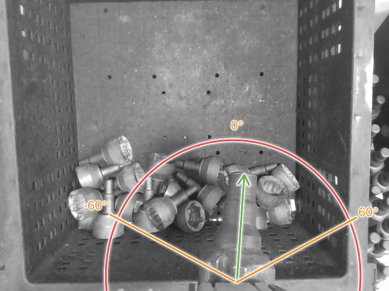
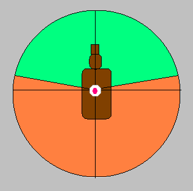
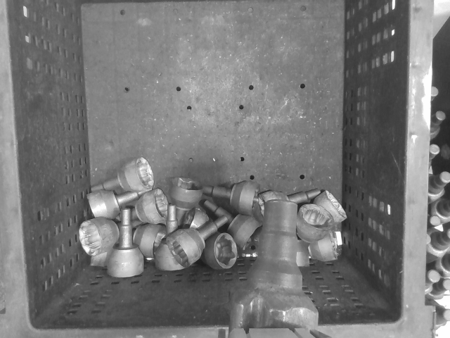
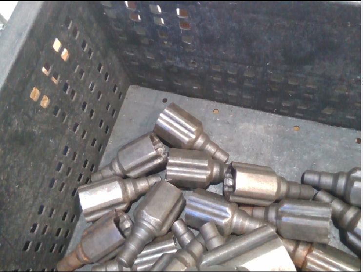

## Task 2: Object Orientation

The goal of this task is check if the attached inboard is upright enough (good) or too slanted (bad).

If the **rotation** of the **object** attached to the robot gripper is **less than a threshold** (e.g: 60 degrees) in any direction from the **vertical axis**, then the **orientation** is **good**, **otherwise** the **orientation** is **bad**. 

Instruction
---
Implement a method to sort the good and bad states from the provided RGB-D data by saving the images in two different folders according to their state. Examples:

**Good**: Object is upright enough, i.e. less than 60° rotated

**Bad**: Object is too slanted, i.e. more than 60° rotated

